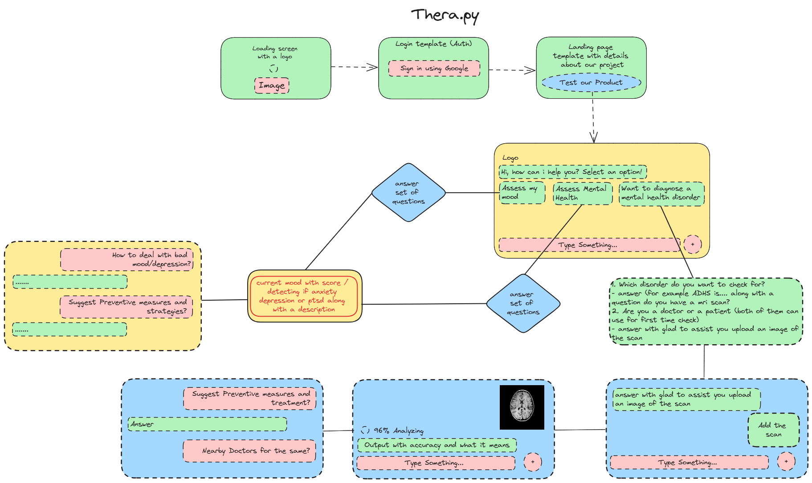

# Thera.py
Thera.py simplifies mental health and neurocognitive care with three key features. Users can chat with an AI-powered therapist anytime, complete a self-diagnosis questionnaire for mental health insights, and analyze MRI scans for early detection of neurocognitive conditions. This seamless approach provides accessible, confidential, and proactive support to enhance overall well-being.

## Impact of our Solution

#### Early Awareness and Self-Management:
Thera.py's AI powered self-diagnosis tools aim to provide users with early awareness of potential mental health concerns or neurocognitive issues. Early identification empowers individuals to take proactive steps, seek professional help when needed, and engage in self-management.

#### Cost-Effective Screening:
Thera.py's features offer cost-effective initial screenings. Users can access preliminary insights, making it more affordable and convenient to identify potential concerns before investing in more expensive professional assessments.

#### Accessibility and Privacy:
Thera.py serves as an accessible and private platform, particularly beneficial for individuals who may face barriers in seeking immediate professional assistance. The platform acts as a first step, encouraging those who might otherwise hesitate to take the first step to mental well-being.

## Flow of the Application 

